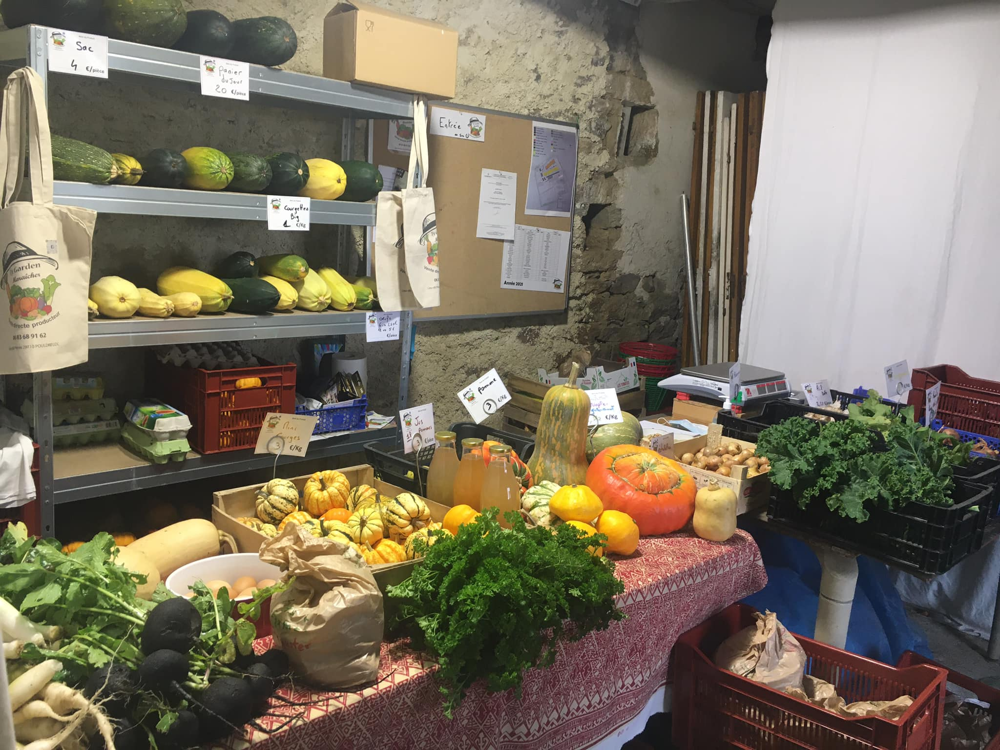
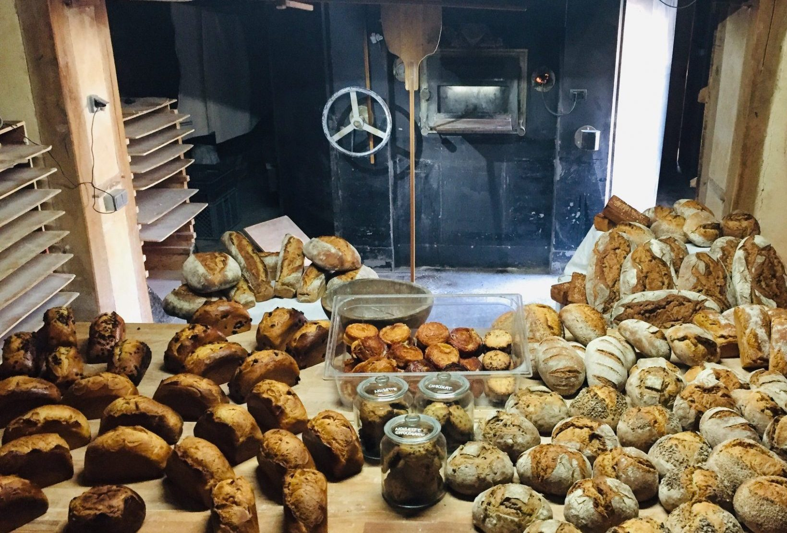

🗓️ tous les vendredis
⏰ 16h30-18h30
📍 Lababan (commune de Pouldreuzic), juste à côté de l'église

 

{:.img-small.img-thumbnail.rounded.float-end}

## Les légumes

David Cahart, installé à Perros, est maraîcher. Il a créé Ty Garden en début d’année. Sur 2 000 m² avec une serre de 240 m², il cultive des légumes, dont des variétés inédites.

Production de légumes anciens de saison, petits fruits ainsi que des plants en vente directe en conversion bio (C2)

Zéro produits phytosanitaires/chimiques et non mécanisé.

{:.img-small.img-thumbnail.rounded.float-end}

## Le pain

Le collectif d'habitants Tête-bêche confectionne **du pain biologique, au levain**, et à base d’**ingrédients du coin**.

Une gamme variée de pain est proposé, vous pouvez la découvrir en visitant [la page consacrée à leur fournil sur leur site](https://tete-beche.bzh/le-fournil/).

## Sol en herbes

Les plants et tisanes

Solen cultive des plantes à Tréogat pour vous proposer des plants et tisanes. Vous pouvez découvrir la présentation de son activité et les plantes proposées en cliquant sur ce lien.

## L...créations
Léa est une passionnée de couture et de création depuis toujours ; après des études dans ce domaine, elle a d'ailleurs été assistante de création pendant plusieurs années.
Aujourd'hui, elle a créé sa propre marque et propose toute une gamme d'objets et accessoires textiles, dont de nombreux produits « zéro déchet » dans une démarche éco-responsable. Elle travaille chez elle, à Lababan (Pouldreuzic).
Toutes ses créations sont artisanales et en série limitée. Vous trouverez un aperçu de ses créations sur sa page Instagram. 
 
